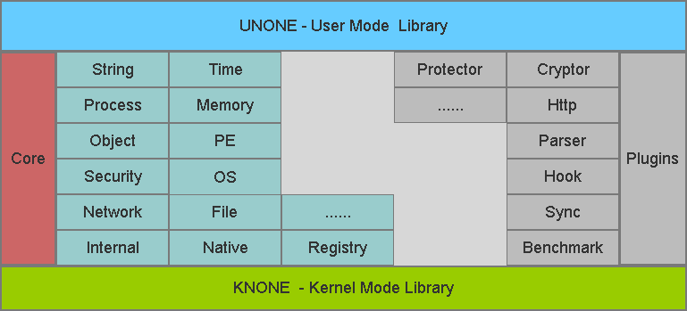

# UNONE

### Introduction

UNONE and KNONE is a couple of open source base library that makes it easy to develop software on Windows. It aimmed at programming, reversing, diving into Windows internal, and evolving into reliable and maintainable project.

### Architecture

* Str - String wrapper
* Os - System environment
* Ps - Process and Thread utility
* Fs - File and Directory utility
* Mm - Memory and Section
* Ob - Object utility
* Se - Security and Privilege
* Tm - Time utility
* Pe - PE Parser
* Net - Network utility
* Reg - Registry
* Int - UNONE internals
* Native - Windows Native structures, types, undocument API and more
* Plugins - 3rd-library and wrapper and unone-based componments

### How to use ?
Use nuget package
* Install by disk: Open console (eg: View - Other Windows - Package Manager Conosle), Install-Package C:\vs2015-unone.1.0.0.nupkg
* Install by server: Set Nuget sources url (Tools - Options - Nuget Package Manager - Package Sources)
* Uninstall: eg: Uninstall-Package vs2015-unone
* BTW: Nuget addons must be installed manualy in Visual Studio 2010.

Use libs or dlls
* Include headers and libs/dlls, then build it.
 
### Who used ?
  * [OpenArk](https://github.com/BlackINT3/OpenArk)

### Distributions
* Binaray (lib/dll/package)
  * static lib 32/64 bit (UNONE)
  * dynamic lib 32/64 bit (UNONE/KNONE)
  * dynamic dll 32/64 bit ((UNONE))
  * .nupkg (UNONE/KNONE)
* Package Manager
  * [Nuget](https://docs.microsoft.com/en-us/nuget/)
  * [CoApp](http://coapp.org/)
  * [Klondike](https://github.com/chriseldredge/Klondike)
* Supported Compiler
  * Visual Studio 2010 (vc100)
  * Visual Studio 2012 (vc110)
  * Visual Studio 2013 (vc120)
  * Visual Studio 2015 (vc140)
  * Visual Studio 2017 (vc141)
  * Visual Studio 2019 (vc142)  

### Contributing
  * Issues and Push request is welcome.