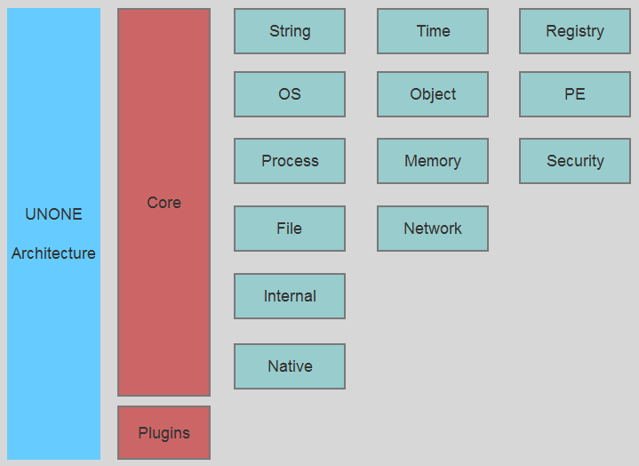

# UNONE

### Introduction

UNONE is a open source base library that makes it easy to develop software on Windows. It aimmed at programming, reversing, diving into Windows internal, and evolving into reliable and maintainable project.

### Architecture

* Str - String wrapper
* Os - System environment
* Ps - Process and Thread utility
* Fs - File and Directory utility
* Mm - Memory and Section
* Ob - Object utility
* Se - Security and Privilege
* Tm - Time
* Pe - PE Parser
* Net - Network
* Reg - Registry
* Int - UNONE internals
* Native - Windows Native structures, types, undocument API and more
* Plugins - Thirdparty library and wrapper and more unone-based componments

### How to use
#### Use package form disk
* Open console (View - Other Windows - Package Manager Conosle)
* Install: Install-Package C:\unone-*.nukpg

#### Use package form server
* Set Nuget sources url (Tools - Options - Nuget Package Manager - Package Sources)
* Install pacakge for Projects

Nuget adddon neeed if Visual Studio 2010 used.

#### Use libs or dlls
* Include headers and libs/dlls, just build it.

#### Uninstall: Uninstall-Package unone
* Uninstall-Package unone
 
### Who used
  * [OpenArk](https://github.com/BlackINT3/OpenArk)

### Distributions
* Binaray (lib/dll/package)
  * static lib 32/64 bit
  * dynamic lib 32/64 bit
  * dynamic dll 32/64 bit
  * .nupkg
* Package Manager
  * [Nuget](https://docs.microsoft.com/en-us/nuget/)
  * [CoApp](http://coapp.org/)
  * [Klondike](https://github.com/chriseldredge/Klondike)
* Supported Compiler
  * Visual Studio 2010 (vc100)
  * Visual Studio 2012 (vc110)
  * Visual Studio 2013 (vc120)
  * Visual Studio 2015 (vc140)
  * Visual Studio 2017 (vc141)
  * Visual Studio 2019 (vc142)  

### Contributing
  * Issues and Push request is welcome.